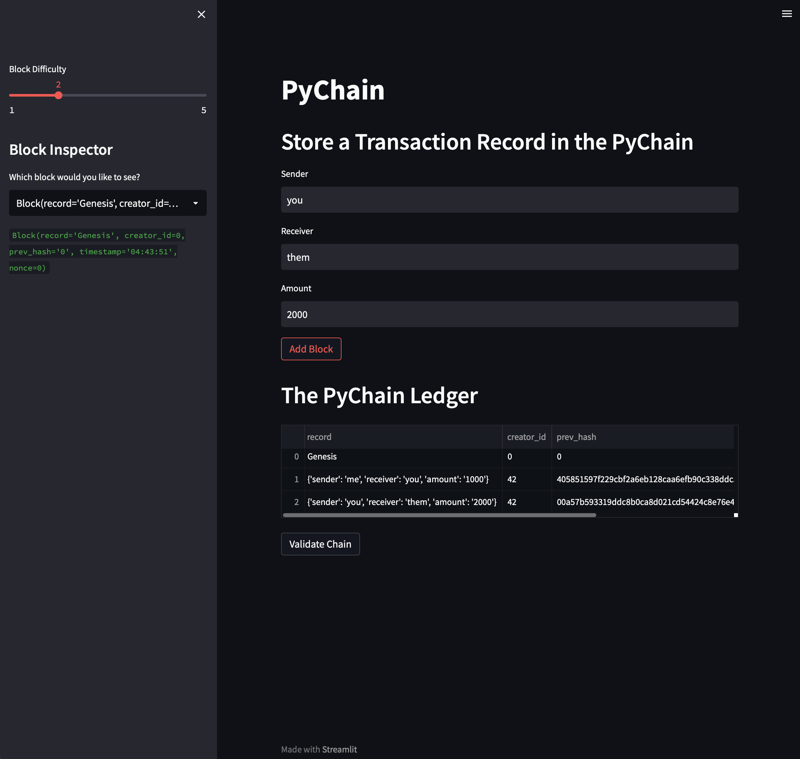
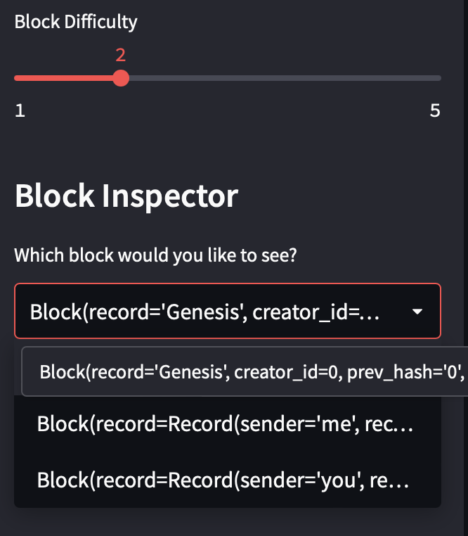
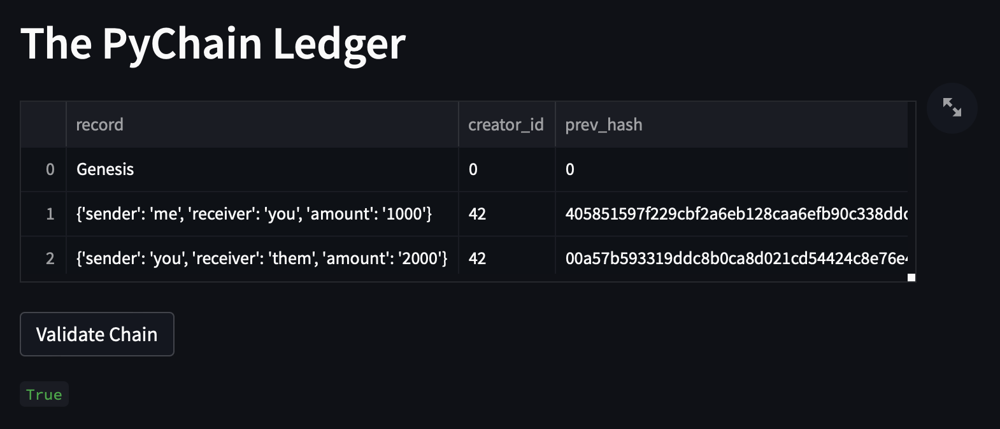

# PyChain Blockchain Ledger

This program is a simple, blockchain based ledger system with a user-friendly web interface. It allows partner banks to conduct financial transactions and verify the integrity of the data contained in the ledger.

---

## Technologies

This application is compatible with Python 3.9.6. (Notice: The program uses Streamlit, which is known to have issues with certain versions of Python. Please make sure you have 3.9.6 for maximum compatibility and to avoid errors when running).

The Pandas, streamit, dataclasses, typing, datetime and hashlib libraries were used. Pandas and streamlit must be installed in order to run the program correctly.

Pandas is used for data science and analysis and machine learning.

Streamlit is used to create custom web apps for machine learning and data science.

Dataclasses provides a decorator and functions for class elements in Python.

Typing provides runtime support for type hints.

Datetime supplies classes for manipulating dates and times.

Hashlib allows for the use and creation of secure hash algorithms.

This program will work on Windows, MacOS and Linux with Python 3.9.6 installed. The user will need to run the program in a code editor such as Juypter Lab or Visual Studio Code.

Documentation for the Pandas library can be found [here.](https://pandas.pydata.org/docs/)

Documentation for the Streamlit library can be found [here.](https://docs.streamlit.io)

Documentation for the dataclasses library can be found [here.](https://docs.python.org/3/library/dataclasses.html)

Documentation for the typing library can be found [here.](https://docs.python.org/3/library/typing.html)

Documentation for the datetime library can be found [here.](https://docs.python.org/3/library/datetime.html)

Documentation for hashlib can be found [here.](https://docs.python.org/3/library/hashlib.html)


---

## Installation Guide

Install the following dependencies before running the program.

To install the pathlib, pandas and matplotlib libraries type the following into your CLI:

```
python
pip install pandas
pip install streamlit
```
---

## Usage

In your CLI, navigate to the folder containing the ```pychain.py``` file.

Input ```conda activate dev``` into your CLI to enter the dev environment.

To run the program simply type ```streamlit run pychain.py```. The program will launch inside of your web browser.

Once the program is loaded, you'll be able to make transactions over the blockchain and interact with the ledger.

---

## Images of the Program

This is what the interface looks like with a few transactions made.



This is what the Block Inspector dropdown looks like populated with data.



This is the ledger that has been validated.



---

## Contributors

Developed by:

Graham Johnstone
Email: johnstonegr@gmail.com

---

## License
This code is published under the Creative Commons License, 2022.

